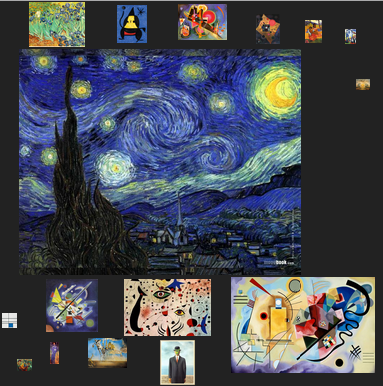

# Picture Cloud Layout

This is a word-cloud-like layout for displaying pictures instead of text, based on the beautiful [Word Cloud Layout](https://github.com/jasondavies/d3-cloud) by Jason Davies. You can see a working example with commented code [here](http://bl.ocks.org/nitaku/6463881).

The layout takes a list of image URLs as input. For each picture, a `weight` parameter must be provided, which identifies the "relevance" of the picture. The layout makes use of that information to scale the pictures, rendering the most relevant ones (high values of `weight`) as bigger images and the least relevant ones (low values of `weight`) as smaller images.

Starting from the biggest picture, the layout displaces all the images without overlapping them, following a more or less spiral path, and using some kind of randomness (which you can control or remove using the nice [seedrandom library](https://github.com/davidbau/seedrandom)).



## Usage

As the original word cloud one, this layout requires [D3](http://mbostock.github.com/d3/), which you can load directly from d3js.org by writing the following into the head section of your HTML:

```html
<script src="http://d3js.org/d3.v3.min.js"></script>
```

You must also include the actual picture cloud layout code, which you can load directly from wafi.iit.cnr.it:

```html
<script src="http://wafi.iit.cnr.it/webvis/picturecloud/d3.layout.picturecloud.js"></script>
```

Provided that you already have an SVG element in your document, you can define the layout as in the following example:

```js
var pictures = []; // pictures that are already displaced by the layout are pushed into this array
var svg = d3.select('svg'); // obtain a d3 reference to the SVG

d3.layout.picturecloud().size([60, 60])
    .pictures([ // define weight and URL for each of the pictures that have to be displaced
        {weight: 86, url: 'miku.jpg'},
        {weight: 31, url: 'rin_len.jpg'},
        {weight: 13, url: 'luka.jpg'},
        {weight: 12, url: 'asuna.jpg'},
        {weight: 18, url: 'haruhi.jpg'},
        {weight: 3, url: 'ia.jpg'}
    ])
    .padding(0.2) // define the minimum distance between pictures
    .on('picture', function(picture, extent) { // whenever a picture is displaced, call this callback
        pictures.push(picture); // store the picture into the global array
        draw(pictures, extent); // call the function that actually draws the picture (more on that below)
    } )
    .start(); // execute the layout
```

The code above runs the layout, which decides the displacement of all the pictures but does not actually draw them into the SVG. In order to do that, you must also implement a function like the following one:

```js
function draw(pictures, extent) {
    svg.selectAll('.picture') // select all elements having the class 'picture'
        .data(pictures) // bind those elements to the global array containing all the pictures that have already been displaced
      .enter().append('image') // for each new picture found, create an SVG image element
        .attr('class', 'picture') // assign the class 'picture' to it
        .attr('xlink:href', function(d) { return d.url; }) // set the source URL for the image
        .attr('width', function(d) { return d.width; }) // set width and height (that have been computed by the layout)
        .attr('height', function(d) { return d.height; })
        .attr('transform', function(d) {
            return 'translate(' + [d.x-d.width/2, d.y-d.height/2] + ')'; // center the image in d.x and d.y (also computed by the layout)
          })
    
    // update the SVG viewBox using extent data (provided by the layout)
    svg.transition()
        .duration(600) // animate the update
        .attr('viewBox', extent.left+' '+extent.top+' '+(extent.right-extent.left)+' '+(extent.bottom-extent.top));
}
```

If you implement an example like that, you can notice that whenever you reload the page you obtain a different displacement. If you want to remove the randomness, you can use [seedrandom](https://github.com/davidbau/seedrandom) to force a specified [random seed](http://en.wikipedia.org/wiki/Random_seed). You can do that by loading the library:

```html
<script src="http://davidbau.com/encode/seedrandom-min.js"></script>
```

and by placing this line *above* the definition of the layout:

```js
Math.seedrandom('yourrandomstringhere');
```
